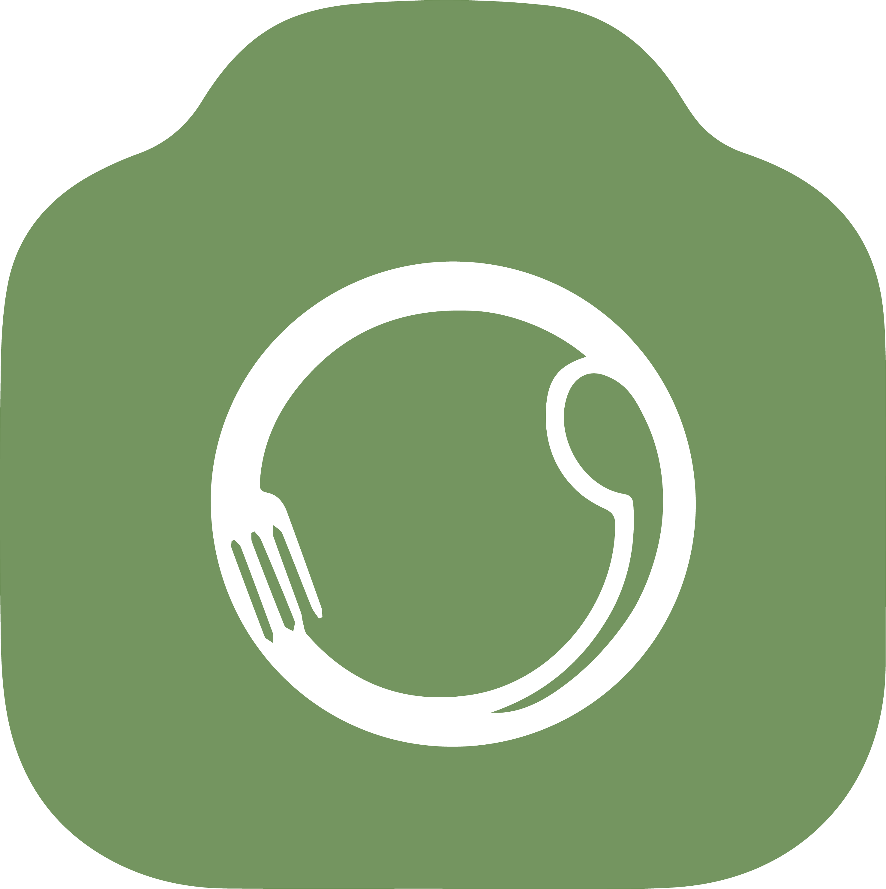

<p align="center">
  
</p>

<h1 align="center">Daily Meal</h1>

<p align="center">
  <strong>Khám phá món ngon, chia sẻ câu chuyện và kết nối cùng cộng đồng yêu ẩm thực.</strong>
</p>

<p align="center">
  <a href="https://github.com/ngocthanhhx7/Daily_Meal_flutter_app/releases/download/v1.0.0-preview/daily-meal-v1.0.0-preview.apk">
    
  </a>
</p>

<p align="center">
  <a href="https://github.com/ngocthanhhx7/Daily_Meal_flutter_app/releases/tag/v1.0.0-preview">Xem ghi chú phát hành</a>
</p>

## Một nơi cho mọi cảm hứng ẩm thực

Daily Meal giúp bạn lưu lại những bữa ăn đáng nhớ, tìm công thức mới và trò
chuyện với những người cùng sở thích. Từ món ăn thường ngày đến trải nghiệm
đặc biệt, mỗi bài đăng là một gợi ý để hôm nay ăn ngon hơn.

## Có gì trong Daily Meal?

- **Khám phá feed theo sở thích** — theo dõi bài viết, tác giả và những chủ đề
  ẩm thực bạn quan tâm.
- **Chia sẻ món ngon dễ dàng** — đăng ảnh, video, mô tả và câu chuyện phía sau
  mỗi món ăn.
- **Tìm kiếm thông minh** — khám phá bài viết và thành viên phù hợp chỉ trong
  vài thao tác.
- **Hồ sơ cá nhân** — quản lý thông tin, bài đăng, người theo dõi và nội dung
  đã lưu.
- **Nhắn tin & thông báo** — giữ liên lạc với cộng đồng và không bỏ lỡ tương
  tác quan trọng.
- **Trải nghiệm Premium** — mở rộng không gian khám phá cho những người muốn
  tận hưởng nhiều hơn.
- **Dùng linh hoạt trên Android và Web** — giao diện responsive, sẵn sàng cho
  nhiều kích thước màn hình.

## Tải và cài đặt APK

1. Nhấn nút **Tải APK — Bản dùng thử** ở đầu trang hoặc tải trực tiếp tại
   [daily-meal-v1.0.0-preview.apk](https://github.com/ngocthanhhx7/Daily_Meal_flutter_app/releases/download/v1.0.0-preview/daily-meal-v1.0.0-preview.apk).
2. Mở file APK sau khi tải xong trên điện thoại Android.
3. Nếu Android hỏi quyền cài đặt từ nguồn này, hãy chọn **Cho phép**.
4. Hoàn tất cài đặt, mở **Daily Meal** và bắt đầu khám phá.

Yêu cầu: thiết bị Android. Kết nối Internet cần thiết để sử dụng các tính năng
trực tuyến.

> [!WARNING]
> Đây là **bản dùng thử (preview)** được ký bằng debug certificate, chưa phải
> bản phát hành trên Google Play. Facebook Login có thể chưa hoạt động đầy đủ
> vì bản preview không chứa Meta Client Token phát hành chính thức. Không dùng
> bản này cho mục đích cần độ ổn định hoặc bảo mật của bản production.


### Yêu cầu môi trường

- Flutter stable với Dart `>=3.11.5`
- Android SDK và Java toolchain cho Android
- Chrome để phát triển Web

```powershell
flutter pub get
flutter analyze --no-pub
flutter test
```

## Kiến trúc ngắn gọn

- `lib/app`: khởi động ứng dụng, Material 3 và routing
- `lib/core`: API, session, responsive layout, realtime và Web Push
- `lib/features`: auth, feed, post, profile, messaging, Premium, Admin và tiện ích người dùng
- `test`: API contracts, controllers và responsive widgets

Phản hồi hoặc góp ý? Hãy tạo issue trong repository này.
